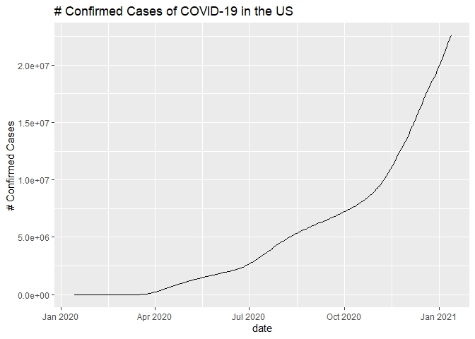
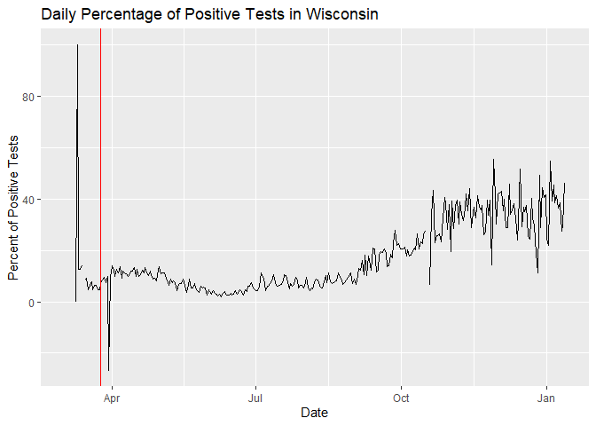
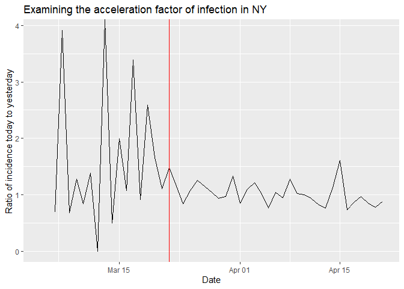
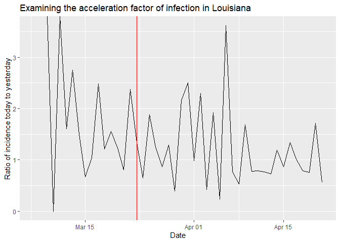
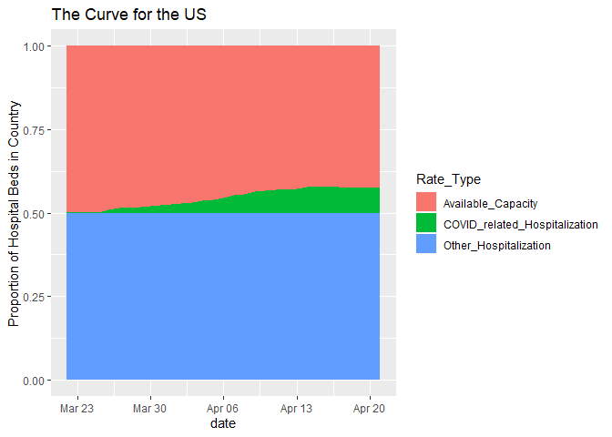
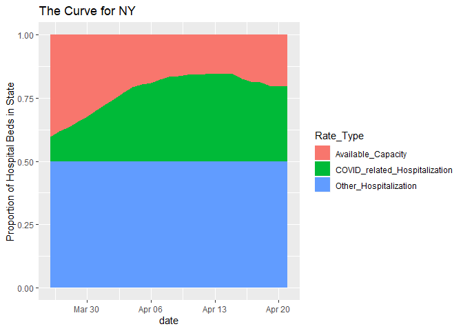
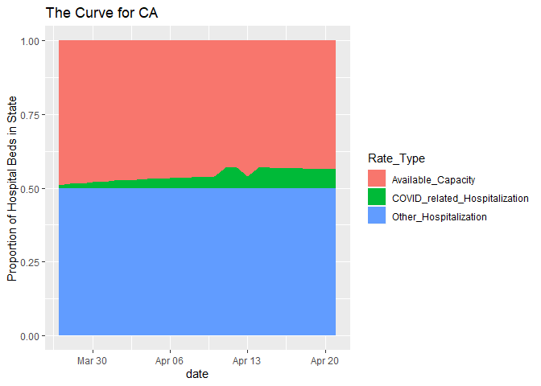

README: COVID-19 Analysis in the US
================

-----

*Visualization:*

<!-- -->

*Our Claim: Social distancing is working to slow infection rates*
-Vertical red line denotes the issue date of stay-home policy
<!-- --><!-- --><!-- -->

*Are we prepared for another spike?* -How much hospital capacity is
available? The Curve for the US as a whole and for some states
<!-- --><!-- --><!-- --><!-- -->
