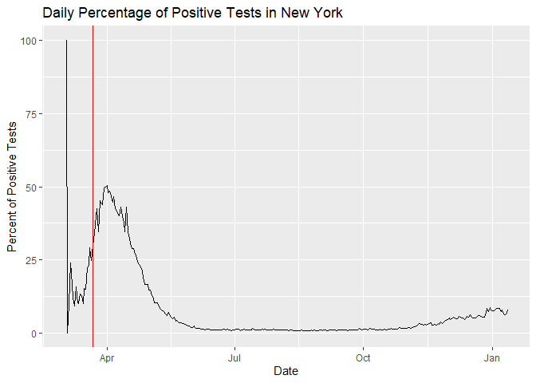
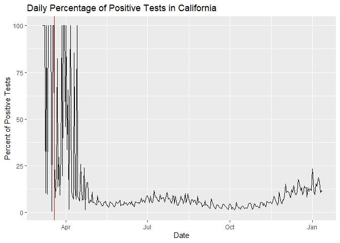

README: COVID-19 Analysis in the US
================

-----

This project provides an interactive Rshiny app which can be used to
understand simple statistics about the COVID-19 pandemic in the US. The
code for this shiny app can be found by clicking here
[COVID-19\_app2/app.R](COVID-19_app2/app.R).

*Visualizations:*

<!-- -->

*Vertical red line denotes the issue date of stay home policy in each
given state*
<!-- --><!-- --><!-- -->

<!-- *Are we prepared for another spike?* -->

<!-- -How much hospital capacity is available? -->

<!-- The Curve for the US as a whole and for some states -->
